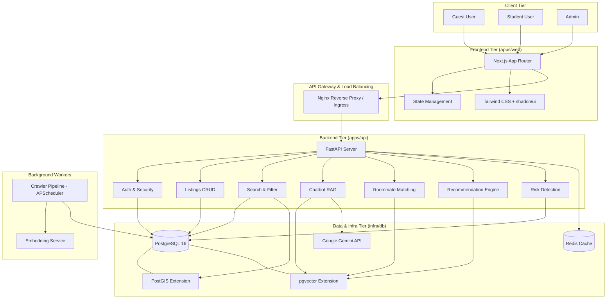
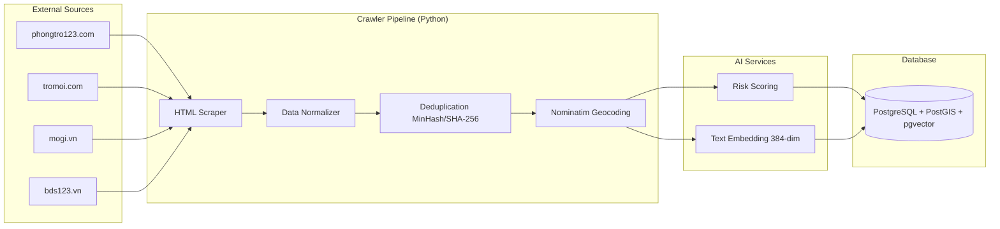
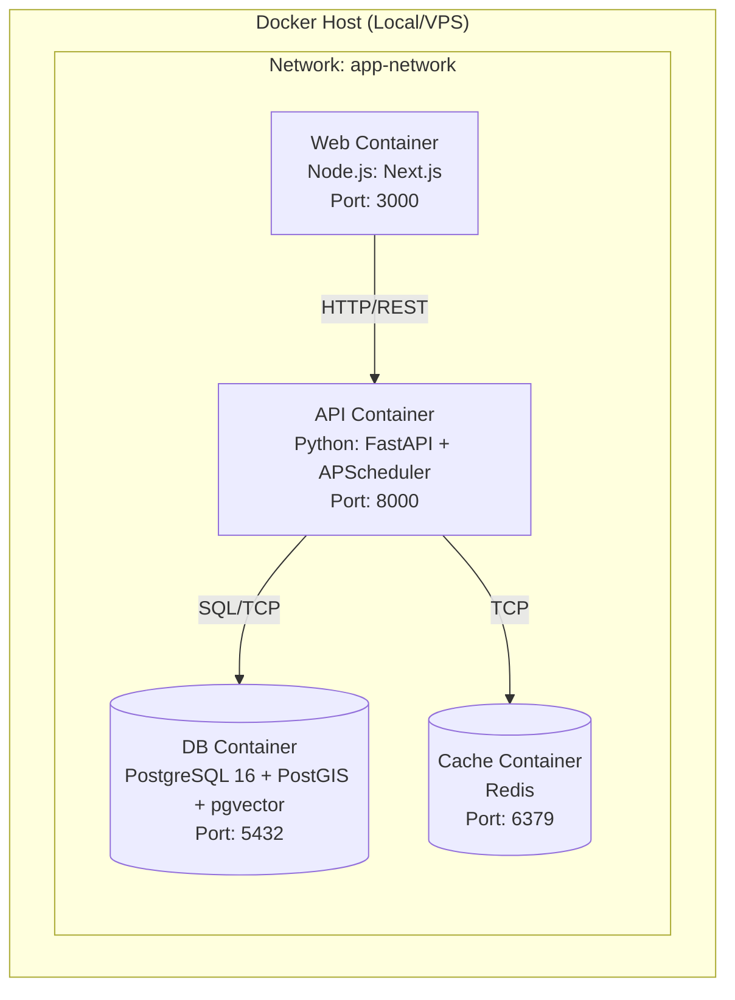

# System Architecture — Trọ CTU

## 1. Kiến trúc Tổng thể (High-level Architecture)

Hệ thống tuân theo kiến trúc Client-Server với các module AI và Crawler chạy bất đồng bộ.

## 2. Luồng Dữ liệu Crawler & AI Pipeline

## 3. Deployment Topology (Docker Compose)

> Hệ thống được đóng gói 100% bằng Docker. Frontend (`apps/web`) gọi Backend (`apps/api`) thông qua mạng nội bộ Docker hoặc qua exposed ports. Crawler chạy dưới dạng background thread (APScheduler) bên trong API Container để tiết kiệm tài nguyên (nguyên tắc P1).
