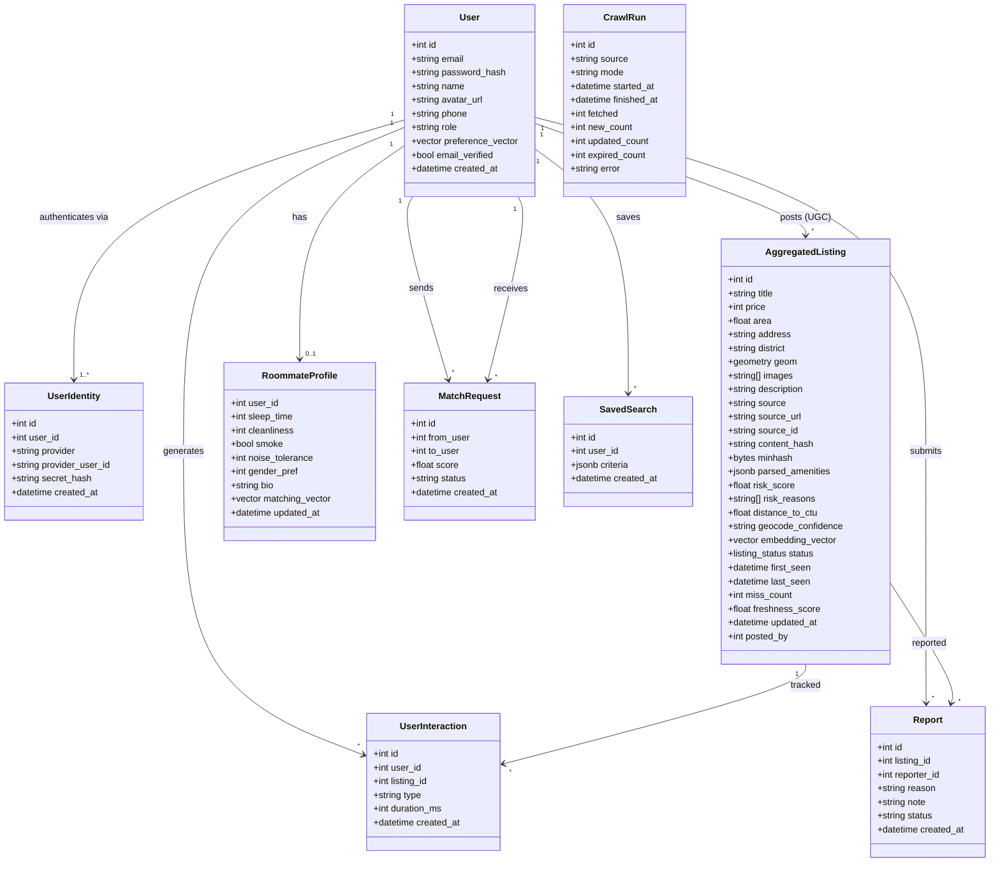

# Class Diagram & ERD — Trọ CTU

## 1. Class Diagram (Domain Entities)



> `UserIdentity` hỗ trợ multi-provider auth: 1 user có thể đăng nhập bằng nhiều cách (local email/password, Google OAuth, CTU MSSV). `password_hash` trên bảng `users` là deprecated — mật khẩu local sống ở `user_identities.secret_hash`.
>
> `AggregatedListing` chứa cả tin crawler lẫn tin UGC (phân biệt qua `source`). `posted_by` nullable — NULL cho tin crawler, FK users(id) cho tin UGC.
>
> Các vector 384-dim (`preference_vector`, `matching_vector`, `embedding_vector`) dùng pgvector cho cosine similarity search, phục vụ gợi ý AI, tìm bạn ở ghép, và chatbot RAG.

### 1.1 Enum liên quan

| Enum | Giá trị | Dùng ở |
|------|---------|--------|
| `listing_status` | active, expired, flagged, hidden | `AggregatedListing.status` |
| `user_role` (varchar) | guest, user, admin | `User.role` |
| `auth_provider` (varchar) | local, google, ctu | `UserIdentity.provider` |
| `interaction_type` (varchar) | view, bookmark, click_source, click_phone | `UserInteraction.type` |
| `report_reason` (varchar) | wrong_price, expired, scam, other | `Report.reason` |
| `report_status` (varchar) | pending, reviewed, dismissed | `Report.status` |
| `match_status` (varchar) | pending, accepted, rejected | `MatchRequest.status` |
| `crawl_mode` (varchar) | incremental, full | `CrawlRun.mode` |

## 2. Entity Relationship Diagram (ERD)

```mermaid
erDiagram
    USERS ||--o{ USER_IDENTITIES : "authenticates via"
    USERS ||--o{ AGGREGATED_LISTINGS : "posts (UGC)"
    USERS ||--o| ROOMMATE_PROFILES : has
    USERS ||--o{ USER_INTERACTIONS : generates
    USERS ||--o{ REPORTS : submits
    USERS ||--o{ MATCH_REQUESTS : "sends (from)"
    USERS ||--o{ MATCH_REQUESTS : "receives (to)"
    USERS ||--o{ SAVED_SEARCHES : saves
    AGGREGATED_LISTINGS ||--o{ USER_INTERACTIONS : tracked
    AGGREGATED_LISTINGS ||--o{ REPORTS : reported

    USERS {
        int id PK
        varchar email UK
        text password_hash "deprecated, dùng user_identities"
        varchar name
        text avatar_url
        varchar phone "lộ khi match accept"
        varchar role "guest|user|admin"
        vector preference_vector "384-dim, gợi ý AI"
        boolean email_verified
        timestamptz created_at
    }

    USER_IDENTITIES {
        int id PK
        int user_id FK
        varchar provider "local|google|ctu"
        varchar provider_user_id UK "email hoặc MSSV hoặc google sub"
        text secret_hash "bcrypt, NULL cho OAuth"
        timestamptz created_at
    }

    AGGREGATED_LISTINGS {
        int id PK
        text title
        int price
        real area
        text address
        varchar district
        geometry geom "Point 4326, PostGIS"
        text_arr images
        text description
        varchar source "phongtro123|tromoi|mogi|bds123|user"
        text source_url
        varchar source_id
        char content_hash "SHA-256 dedup"
        bytea minhash "LSH cross-source dedup"
        jsonb parsed_amenities
        real risk_score
        text_arr risk_reasons
        real distance_to_ctu "haversine meters"
        varchar geocode_confidence "high|medium|low|failed"
        vector embedding_vector "384-dim, RAG search"
        listing_status status "active|expired|flagged|hidden"
        timestamptz first_seen
        timestamptz last_seen
        int miss_count "freshness tracking"
        real freshness_score "0.0 - 1.0"
        timestamptz updated_at
        int posted_by FK "nullable, NULL = crawler"
    }

    ROOMMATE_PROFILES {
        int user_id PK_FK
        int sleep_time "0 sớm|1 thường|2 cú đêm"
        int cleanliness "1-5"
        boolean smoke
        int noise_tolerance "1-5"
        int gender_pref "0 ko quan tâm|1 nam|2 nữ"
        text bio
        vector matching_vector "384-dim"
        timestamptz updated_at
    }

    USER_INTERACTIONS {
        int id PK
        int user_id FK
        int listing_id FK
        varchar type "view|bookmark|click_source|click_phone"
        int duration_ms
        timestamptz created_at
    }

    REPORTS {
        int id PK
        int listing_id FK
        int reporter_id FK
        varchar reason "wrong_price|expired|scam|other"
        text note
        varchar status "pending|reviewed|dismissed"
        timestamptz created_at
    }

    MATCH_REQUESTS {
        int id PK
        int from_user FK
        int to_user FK
        real score "cosine similarity"
        varchar status "pending|accepted|rejected"
        timestamptz created_at
    }

    SAVED_SEARCHES {
        int id PK
        int user_id FK
        jsonb criteria "min_price, max_price, district, amenities"
        timestamptz created_at
    }

    CRAWL_RUNS {
        int id PK
        varchar source
        varchar mode "incremental|full"
        timestamptz started_at
        timestamptz finished_at
        int fetched
        int new_count
        int updated_count
        int expired_count
        text error
    }
```

## 3. Ràng buộc & Index quan trọng

- `Users.email` — unique index.
- `UserIdentities(provider, provider_user_id)` — unique (mỗi provider chỉ 1 identity/user).
- `AggregatedListings(source, source_id)` — unique (mỗi tin mỗi nguồn chỉ 1 bản ghi).
- `AggregatedListings.geom` — GIST index (PostGIS spatial query).
- `AggregatedListings(status, last_seen)` — composite index (filter + sort).
- `AggregatedListings.content_hash` — index (dedup lookup nhanh).
- `AggregatedListings.posted_by` — index (lọc tin theo user).
- `MatchRequests(from_user, to_user)` — unique (không mời trùng).
- `CrawlRuns(source, started_at DESC)` — index (health check gần nhất).
- `UserInteractions(user_id, created_at DESC)` — index (lịch sử tương tác gần nhất).
- **Ràng buộc tầng application:** User chỉ sửa/xóa listing có `posted_by == user_id`; Admin bỏ qua check này. Kiểm tra ở `ListingWriteRepo.get_owner()` + router, vi phạm → 403.
