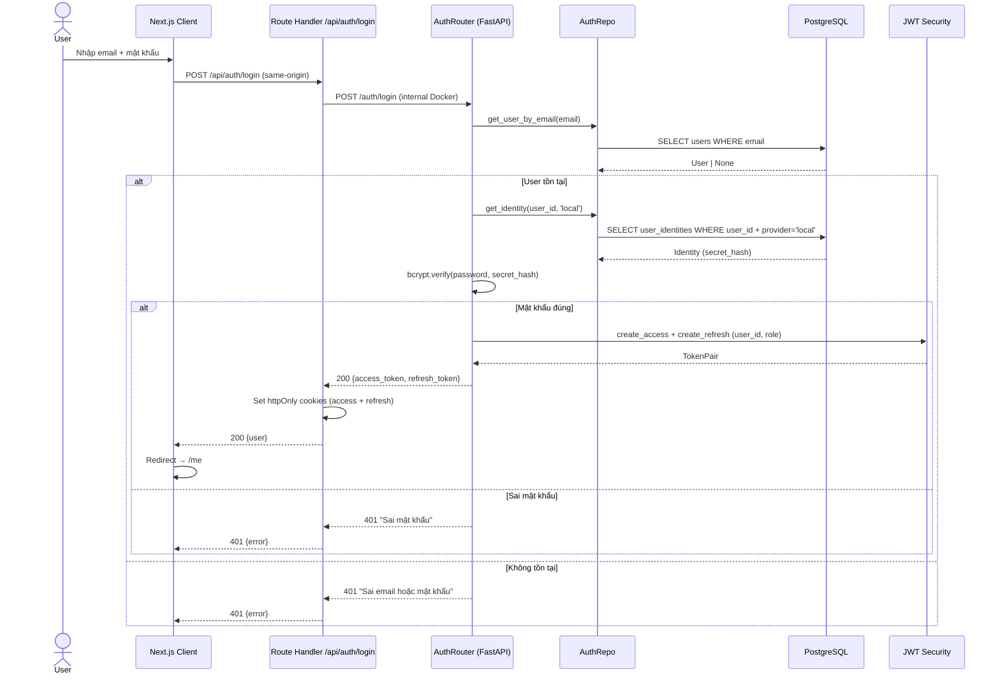
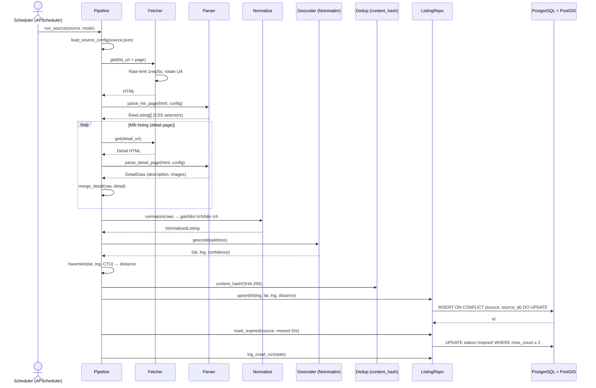
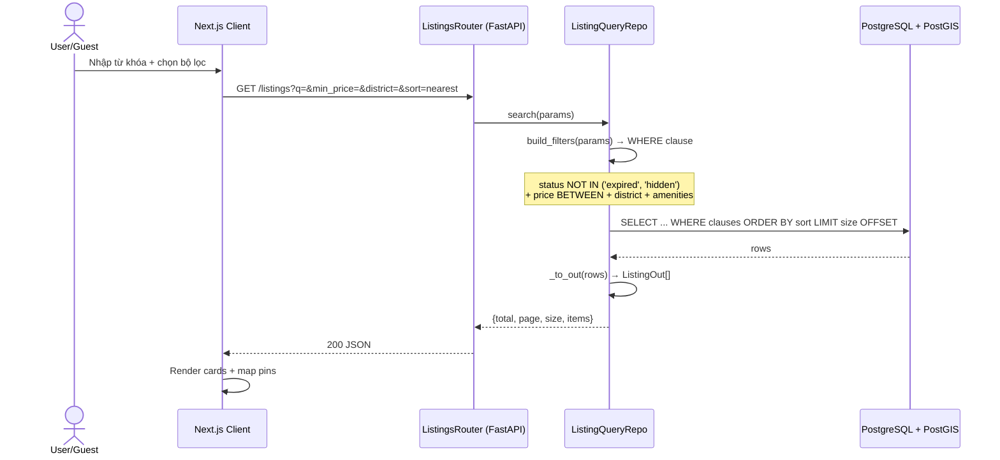
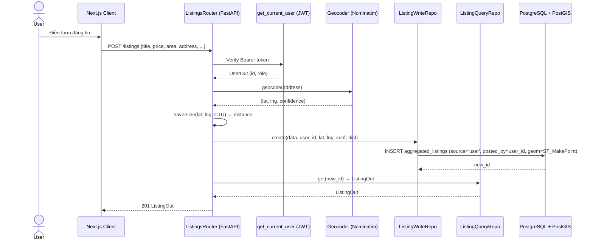
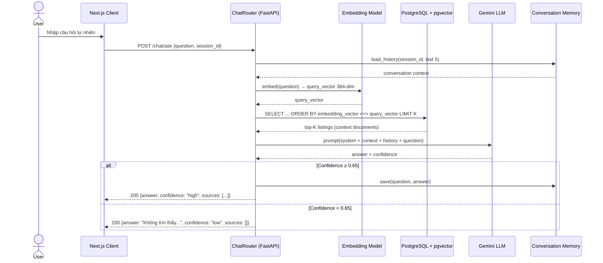
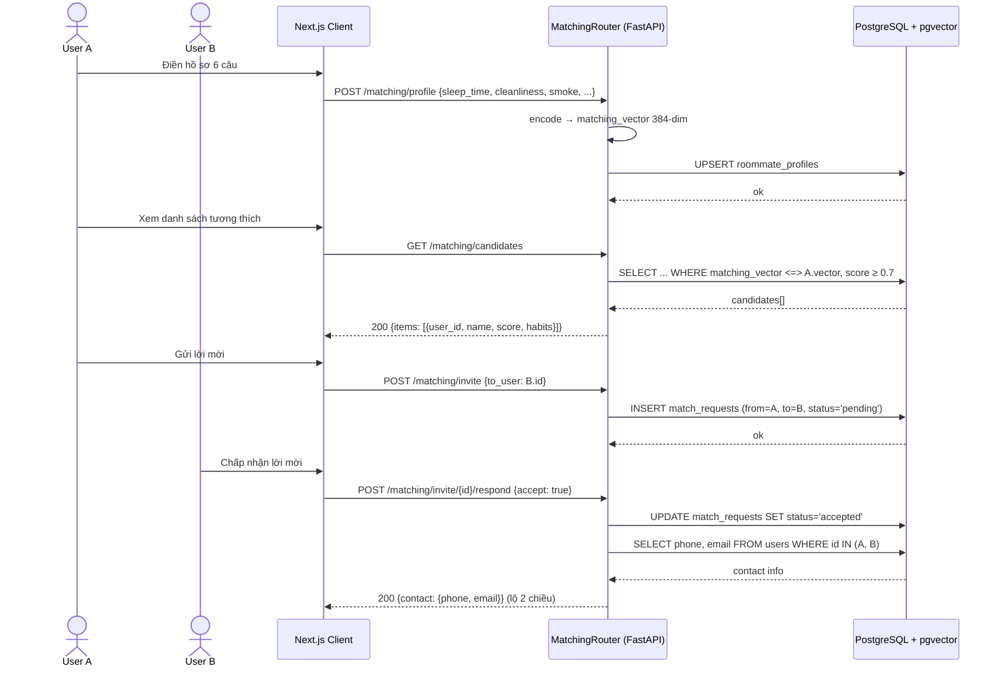

# Sequence Diagrams — Trọ CTU

Các sơ đồ tuần tự cho luồng nghiệp vụ chính. Lớp tham chiếu: Router → Service/Repo → Database/External.

## 1. Đăng nhập (Login — Multi-provider)

> Token được lưu trong **httpOnly cookie** (chống XSS) bởi Next.js Route Handler — frontend JS không bao giờ chạm token. Access token TTL 15 phút, refresh 30 ngày.

## 2. Crawl Pipeline (Tự động / Thủ công)

> Mỗi nguồn được cấu hình bằng 1 file JSON (`sources/<name>.json`) chứa CSS selectors — thêm nguồn mới không cần sửa code Python. Scheduler chạy: incremental mỗi 5h (trang 1-2), full sweep 3h sáng.

## 3. Tìm kiếm & Lọc

## 4. Đăng tin UGC + Geocode

## 5. Chatbot RAG

> Confidence thresholding (T8): hệ thống **không bịa** — nếu không tìm thấy thông tin đáng tin cậy, trả lời fallback thay vì hallucinate. Conversation memory giữ 5 lượt gần nhất cho multi-turn context.

## 6. Tìm bạn ở ghép (Roommate Matching)

> Liên hệ (phone/email) chỉ lộ khi **cả hai bên** đồng ý — bảo vệ quyền riêng tư sinh viên. Weighted Cosine Similarity threshold 0.7 lọc bỏ ứng viên không tương thích.
