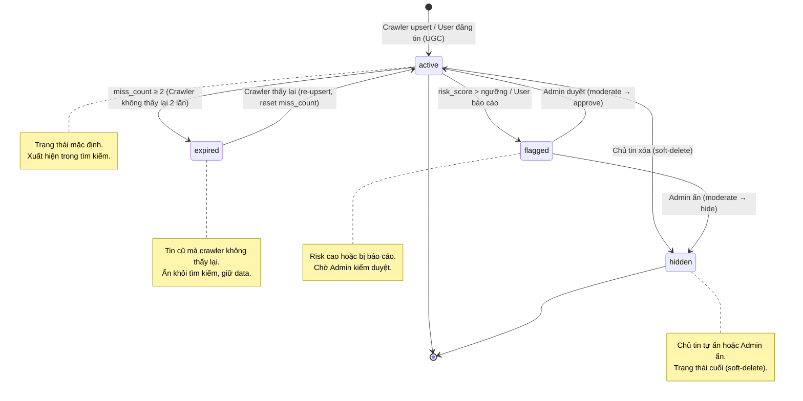
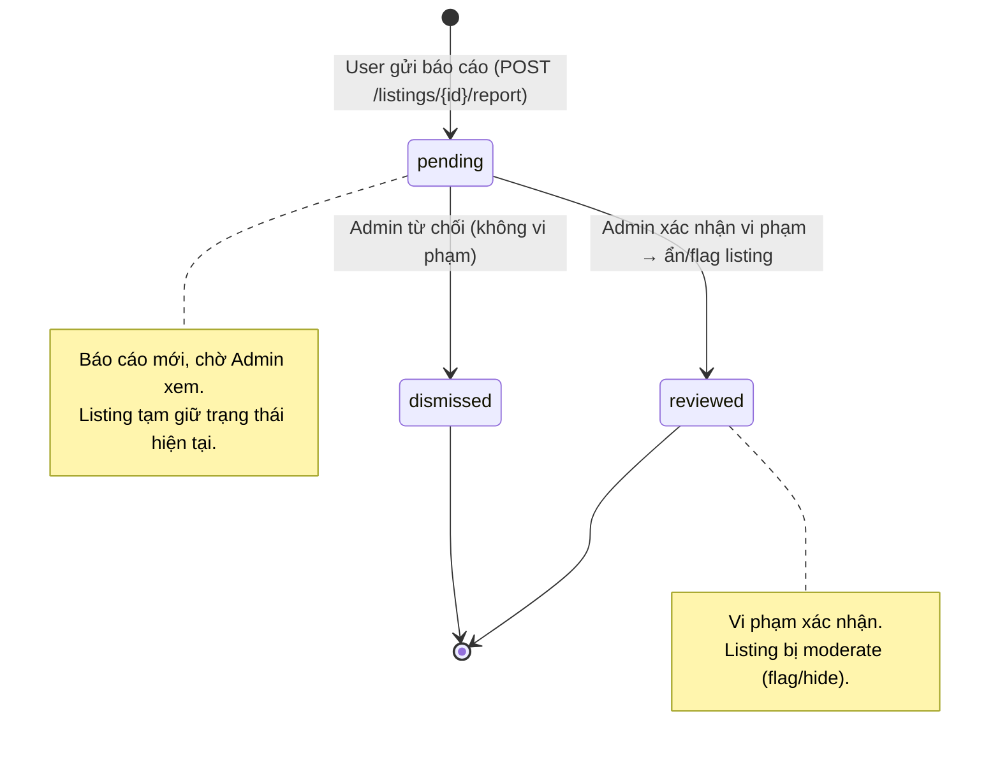
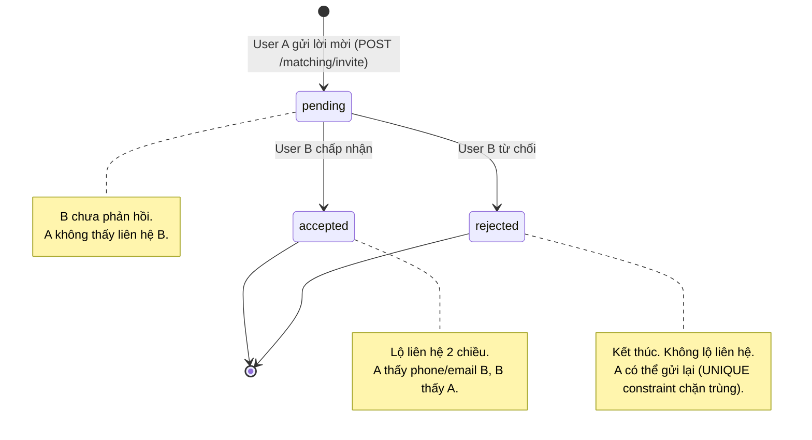
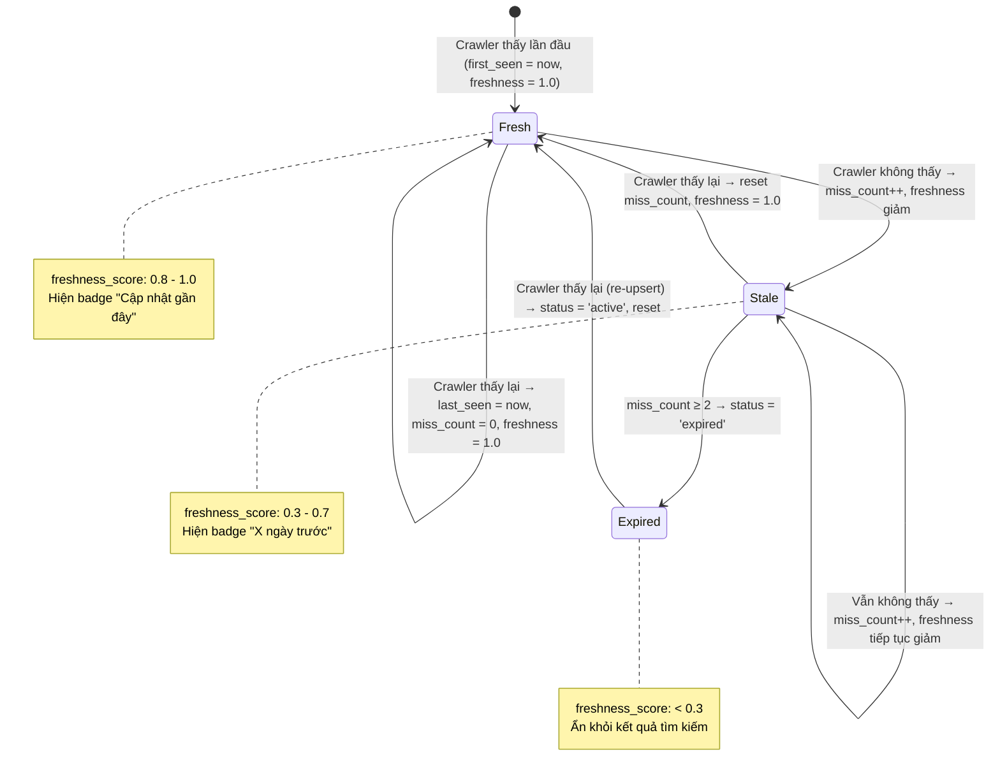
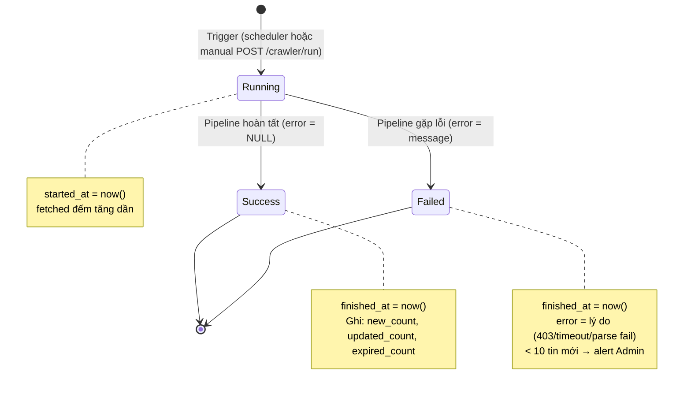

# State Machine Diagrams — Trọ CTU

## 1. Vòng đời Tin đăng (Listing)

Quy tắc cài đặt trong `ListingWriteRepo` (Backend) + Crawler pipeline. Mọi chuyển trạng thái ngoài các cạnh hợp lệ bị từ chối.

**Bảng chuyển trạng thái hợp lệ:**

| Từ \ Đến | active | expired | flagged | hidden |
|-----------|:------:|:-------:|:-------:|:------:|
| active    | — | ✅ | ✅ | ✅ |
| expired   | ✅ | — | ❌ | ❌ |
| flagged   | ✅ | ❌ | — | ✅ |
| hidden    | ❌ | ❌ | ❌ | — |

> `hidden` là trạng thái cuối — tin bị soft-delete không phục hồi tự động. `expired` có thể trở lại `active` nếu crawler phát hiện tin xuất hiện lại trên nguồn. Nguyên tắc P2: **Không xóa dữ liệu hợp lệ**, chỉ ẩn.

---

## 2. Vòng đời Báo cáo (Report)

Cài đặt trong Report workflow. Admin kiểm duyệt từ dashboard.

---

## 3. Vòng đời Lời mời Ở ghép (Match Request)

Cài đặt trong Matching module. Lời mời 1 chiều, kết quả 2 chiều.

---

## 4. Vòng đời Freshness (Độ tươi dữ liệu)

Logic scoring tự động trong Crawler pipeline. Không phải state machine thuần túy mà là continuous scoring.

---

## 5. Vòng đời Crawl Run

Mỗi lần chạy crawler ghi 1 bản ghi `crawl_runs` để monitoring.

> Health check: nếu `new_count < 10` trong 1 lần crawl full → cảnh báo Admin có thể nguồn bị chặn hoặc layout đổi.
