# Use Case Diagram & Đặc tả Use Case — Trọ CTU

## 1. Sơ đồ Use Case

```mermaid
graph TB
    Guest([Guest])
    User([User - Sinh viên])
    Admin([Admin])
    System([System - Cron/AI])

    subgraph "Hệ thống Trọ CTU"
        UC1[UC-01 Đăng ký]
        UC2[UC-02 Đăng nhập]
        UC3[UC-03 Tìm kiếm & lọc tin]
        UC4[UC-04 Xem chi tiết tin]
        UC5[UC-05 Xem bản đồ & nearby]
        UC6[UC-06 Đăng tin UGC]
        UC7[UC-07 Sửa / ẩn tin của mình]
        UC8[UC-08 Lưu tin & lưu tìm kiếm]
        UC9[UC-09 Gợi ý AI - For You]
        UC10[UC-10 Chatbot RAG hỏi đáp]
        UC11[UC-11 Tìm bạn ở ghép]
        UC12[UC-12 Gửi / chấp nhận lời mời ghép]
        UC13[UC-13 Báo cáo tin sai]
        UC14[UC-14 Kiểm duyệt tin flagged]
        UC15[UC-15 Dashboard Admin]
        UC16[UC-16 Quản lý crawler]
        UC17[UC-17 Quản lý người dùng]
        UC18[UC-18 Crawl tự động]
        UC19[UC-19 Geocoding & tính khoảng cách]
        UC20[UC-20 Risk Detection AI]
        UC21[UC-21 Freshness scoring]
    end

    Guest --> UC1
    Guest --> UC2
    Guest --> UC3
    Guest --> UC4
    Guest --> UC5

    User --> UC3
    User --> UC4
    User --> UC5
    User --> UC6
    User --> UC7
    User --> UC8
    User --> UC9
    User --> UC10
    User --> UC11
    User --> UC12
    User --> UC13

    Admin --> UC14
    Admin --> UC15
    Admin --> UC16
    Admin --> UC17

    System --> UC18
    System --> UC19
    System --> UC20
    System --> UC21

    UC6 -.->|include| UC19
    UC9 -.->|extend| UC3
    UC10 -.->|include| UC3
    UC11 -.->|include| UC12
    UC18 -.->|include| UC19
    UC18 -.->|include| UC20
    UC18 -.->|include| UC21
```

> User kế thừa mọi use case của Guest (đã đăng nhập). Admin kế thừa User + thêm quyền quản trị. System là tác nhân tự động (Scheduler, AI pipeline) không tương tác trực tiếp với người dùng.
>
> Danh sách tin (`GET /listings`) trả kết quả có phân trang (`page`, `size`, mặc định 20). Chỉ tin `status = active` xuất hiện — tin `expired` và `hidden` bị ẩn hoàn toàn khỏi kết quả tìm kiếm và detail.
>
> Tin đăng có 2 nguồn: Crawler tự động (`source = phongtro123|tromoi|mogi|bds123`) và UGC (`source = user`, `posted_by` FK users). Ownership: chỉ chủ tin hoặc Admin được sửa/xóa (soft-delete → `status = hidden`).

---

## 2. Đặc tả Use Case chi tiết

### UC-02: Đăng nhập (Multi-provider)
| Mục | Nội dung |
|-----|----------|
| **Actor** | Guest |
| **Mục tiêu** | Xác thực và nhận JWT (access + refresh) |
| **Tiền điều kiện** | Tài khoản tồn tại trong `users` + `user_identities` |
| **Hậu điều kiện** | Client nhận token pair; các request sau gắn Bearer |
| **Luồng chính** | 1. Người dùng nhập email + mật khẩu. 2. Hệ thống tìm user theo email. 3. Tra `user_identities` provider='local' lấy `secret_hash`. 4. Verify bcrypt. 5. Sinh JWT access (15p) + refresh (30 ngày) chứa user_id + role. 6. Trả `TokenPair + UserOut`. |
| **Luồng thay thế** | 2a. Email không tồn tại → 401. 4a. Sai mật khẩu → 401. Provider='google' → OAuth flow riêng. Provider='ctu' → verify MSSV qua stub. |

### UC-03: Tìm kiếm & Lọc tin
| Mục | Nội dung |
|-----|----------|
| **Actor** | Guest / User |
| **Luồng chính** | 1. Nhập từ khóa + bộ lọc (giá, diện tích, quận, tiện ích, khoảng cách CTU). 2. Hệ thống build WHERE clause động (`build_filters`), chỉ trả `status NOT IN ('expired', 'hidden')`. 3. Sắp xếp (giá ↑↓, mới nhất, gần CTU nhất, độ tươi). 4. Phân trang, trả kết quả kèm `freshness_score`, `risk_level`, `distance_to_ctu`. |
| **Luồng thay thế** | Không có kết quả → trả `items: []`, `total: 0`. |

### UC-05: Xem bản đồ & Tìm lân cận (Nearby)
| Mục | Nội dung |
|-----|----------|
| **Actor** | Guest / User |
| **Luồng chính** | 1. Gửi `GET /listings/nearby?lat=&lng=&radius=`. 2. Hệ thống dùng PostGIS `ST_DWithin` tìm tin trong bán kính. 3. Sắp xếp theo khoảng cách tăng dần. 4. Trả danh sách kèm tọa độ để frontend render pin trên Leaflet/OSM. |

### UC-06: Đăng tin UGC
| Mục | Nội dung |
|-----|----------|
| **Actor** | User |
| **Tiền điều kiện** | Đã đăng nhập |
| **Hậu điều kiện** | Listing mới source='user', posted_by=user_id, status='active' |
| **Luồng chính** | 1. User gửi `POST /listings` {title, price, area, address, district, description, images}. 2. Validate (title bắt buộc). 3. Geocode address → lat, lng, confidence. 4. Tính distance_to_ctu via haversine. 5. INSERT vào `aggregated_listings` với geom = ST_MakePoint. 6. Trả ListingOut (201). |
| **Luồng thay thế** | Address không geocode được → geom NULL, distance NULL, listing vẫn tạo. |

### UC-07: Sửa / Ẩn tin của mình
| Mục | Nội dung |
|-----|----------|
| **Actor** | User / Admin |
| **Tiền điều kiện** | Tin tồn tại; user là chủ tin hoặc Admin |
| **Luồng chính (Sửa)** | 1. `PUT /listings/{id}` với fields thay đổi (partial update). 2. Check ownership (`posted_by == user_id` hoặc `role == 'admin'`). 3. Nếu address đổi → re-geocode. 4. UPDATE fields + `updated_at = now()`. |
| **Luồng chính (Ẩn)** | 1. `DELETE /listings/{id}`. 2. Check ownership. 3. SET `status = 'hidden'` (soft-delete, không xóa vật lý). |
| **Ngoại lệ** | Không phải chủ → 403. Tin không tồn tại → 404. |

### UC-09: Gợi ý AI (Dành cho bạn)
| Mục | Nội dung |
|-----|----------|
| **Actor** | User |
| **Luồng chính** | 1. User mở trang "Dành cho bạn" (`GET /recommend/for-you`). 2. Hệ thống lấy `preference_vector` (384-dim) từ users. 3. pgvector cosine similarity top-10. 4. ε-greedy 80/20: 80% exploit top similar, 20% explore random (chống filter bubble). |
| **Cold-start** | Chưa có preference_vector → fallback Popularity-Based (tin nhiều view/bookmark). |

### UC-10: Chatbot RAG
| Mục | Nội dung |
|-----|----------|
| **Actor** | User |
| **Luồng chính** | 1. User gửi câu hỏi NLP (`POST /chat/ask`). 2. Hệ thống embed câu hỏi → vector search top-K tin liên quan. 3. Nạp context + câu hỏi vào LLM (Gemini). 4. Confidence ≥ 0.65 → trả lời kèm `sources[]`. 5. Lưu conversation memory (5 lượt gần nhất). |
| **Luồng thay thế** | Confidence < 0.65 → fallback: "Không tìm thấy thông tin phù hợp." (không bịa). |

### UC-11: Tìm bạn ở ghép
| Mục | Nội dung |
|-----|----------|
| **Actor** | User |
| **Luồng chính** | 1. User điền hồ sơ 6 câu (`POST /matching/profile`): sleep_time, cleanliness, smoke, noise_tolerance, gender_pref, bio. 2. Hệ thống encode → `matching_vector` 384-dim. 3. `GET /matching/candidates` → Weighted Cosine ≥ 0.7, trả danh sách tương thích. 4. Gửi lời mời (`POST /matching/invite`). 5. Bên kia chấp nhận → lộ liên hệ 2 chiều (phone/email). |

### UC-14: Kiểm duyệt tin flagged (Admin)
| Mục | Nội dung |
|-----|----------|
| **Actor** | Admin |
| **Luồng chính** | 1. Xem DS tin flagged (`GET /admin/listings/flagged`). 2. Duyệt (`POST /admin/listings/{id}/moderate` action=approve → status='active') hoặc ẩn (action=hide → status='flagged'). |

### UC-18: Crawl tự động (System)
| Mục | Nội dung |
|-----|----------|
| **Actor** | System (APScheduler) |
| **Luồng chính** | 1. Cron trigger: incremental mỗi 5h (trang 1-2), full sweep 3h sáng. 2. Load JSON config từ `sources/<name>.json`. 3. Fetch HTML (rate-limit 1req/5s, xoay User-Agent). 4. Parse CSS selectors. 5. Normalize (giá/diện tích/tiện ích). 6. Dedup content_hash + MinHash. 7. Geocode → lat/lng. 8. Upsert vào DB (UNIQUE source+source_id). 9. Ghi `crawl_runs` log. |
| **4 nguồn** | phongtro123, tromoi, mogi, bds123 (JSON config, không hard-code parser). |
