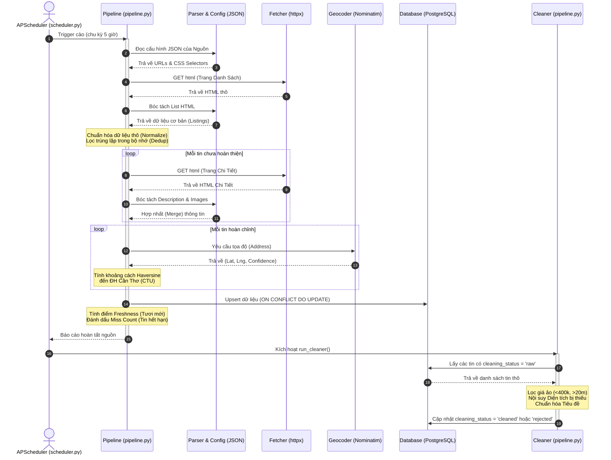

# Technical Specification: Crawler Pipeline

Tài liệu này đặc tả luồng hoạt động (Data Flow & Architecture) của module Crawler và Data Cleaning trong dự án. Hệ thống được thiết kế theo mô hình **Config-Driven & Multi-Phase** (Điều khiển bằng cấu hình và chia làm nhiều giai đoạn), tuân thủ nguyên tắc Single Responsibility.

---

## 1. Sơ đồ Hoạt động (Sequence Diagram)

Dưới đây là sơ đồ Mermaid mô tả toàn bộ vòng đời của dữ liệu từ khi nằm trên trang web nguồn cho đến khi trở thành dữ liệu "sạch" trong cơ sở dữ liệu.

---

## 2. Giải thích chi tiết các Giai đoạn (Phases)

### Phase 1: Kích hoạt (Triggering)
- **Cron Scheduler (`scheduler.py`)**: Công cụ `APScheduler` chạy ngầm, theo chu kỳ 5 tiếng sẽ kích hoạt tiến trình cào cho danh sách `ENABLED_SOURCES` (như *phongtro123, tromoi, mogi, bds123, nhadatcantho, nhadatcantho247*).
- Từng nguồn sẽ được truyền vào hàm `run_source(source, mode)`. Chế độ (mode) mặc định là `"incremental"` (cào tăng dần - quét các trang mới nhất) hoặc `"full"` (quét toàn bộ).
- Một bản ghi `run_id` được tạo trong bảng `crawl_runs` để theo dõi tiến độ.

### Phase 2: Cào Trang Danh sách (List Crawl & Parse)
- **Load Config**: Module `parser.py` đọc file `.json` tương ứng của nguồn để lấy cấu trúc như `base_url`, `list_url`, và bộ `selectors`.
- **Fetch HTML**: Lớp `Fetcher` sử dụng thư viện `httpx.AsyncClient` kết nối mạng và tải mã nguồn HTML.
- **Parse HTML (`process_html_pages`)**: Trình phân tích `selectolax` sử dụng các CSS Selector trong file JSON để bóc tách thông tin cơ bản: *Title, Price, Area, Address, Thumbnail*.
- **Normalize & Dedup**: Dữ liệu thô qua hàm `normalize()` để ép kiểu. Sau đó, hệ thống lọc các tin bị trùng lặp ngay trong bộ nhớ (Cross-source Dedup).

### Phase 3: Cào Trang Chi tiết (Detail Crawl)
- Đối với các tin mới cào được (và chưa đủ thông tin ở trang danh sách), hệ thống tiếp tục dùng `Fetcher` truy cập vào link chi tiết của phòng trọ.
- **Merge Detail**: Trích xuất thêm `description` (Mô tả dài) và `images` (Mảng link ảnh gốc). 
- *Fallback Mechanism*: Nếu Diện tích (Area) hoặc Giá (Price) ở trang danh sách bị thiếu, hàm `merge_detail()` sẽ dùng Regex để nội suy lại dữ liệu từ đoạn văn bản Mô tả.

### Phase 4: Tính toán Vị trí (Geocoding & Freshness)
- **Geocode**: Mảng dữ liệu chạy qua lớp `Geocoder` (sử dụng Nominatim API của OpenStreetMap). Dịch vụ này chuyển đổi văn bản `address` thành tọa độ `(lat, lng)` và tính `geocode_confidence` (Độ tin cậy của địa chỉ).
- **Distance**: Dựa trên tọa độ, hệ thống dùng công thức tính đường tròn lớn (Haversine) để tính khoảng cách (`distance_to_ctu`) tính bằng mét từ phòng trọ đến tọa độ trung tâm của Đại học Cần Thơ.

### Phase 5: Ghi Cơ Sở Dữ Liệu (DB Upsert & Scoring)
- **Database Upsert**: `ListingRepo` đổ mảng dữ liệu vào bảng `aggregated_listings` trong PostgreSQL bằng cơ chế Update-on-Conflict.
- **Scoring**: Cập nhật `freshness_score` (điểm tươi mới). Nếu chạy chế độ `full`, các tin cũ không còn tồn tại trên nguồn sẽ bị tăng `miss_count`, làm tiền đề đánh dấu hết hạn (expired).
- Hệ thống update trạng thái của `crawl_runs` thành công và đóng kết nối TCP.

### Phase 6: Hậu xử lý & Làm sạch (Data Cleaning Plugin)
- Ngay sau khi mọi nguồn hoàn tất, `scheduler.py` gọi hàm `run_cleaner()`.
- Module này lấy tất cả các bản ghi vừa ghi vào DB (có cờ `cleaning_status = 'raw'`).
- Nó thực hiện các quy trình:
  - Loại bỏ các mức giá rác (VD: cố tình nhập 10.000 VNĐ hoặc 1 tỷ VNĐ để lên top).
  - Nội suy các diện tích bị thiếu từ mô tả hoặc giá tiền.
  - Sắp xếp và định dạng lại Title cho chuyên nghiệp.
- Cuối cùng, cập nhật cờ `cleaning_status` thành `cleaned` (Sạch) hoặc `rejected` (Bị loại trừ). Dữ liệu lúc này đã sẵn sàng 100% cho AI sử dụng.
